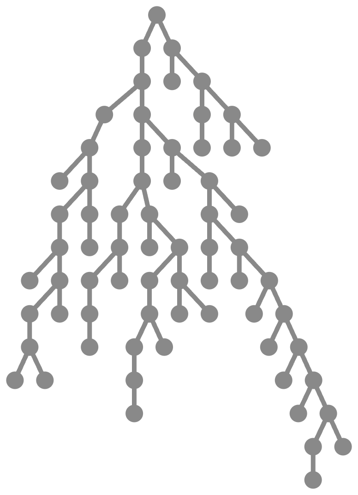

# LambAda

LambAda is lightweight syntactic sugar for writing programs using minimal calculi.
[The interactive tree calculus playground](https://treecalcul.us/live/) uses LambAda
and this repo focuses on writing programs in [tree calculus, specifically _triage calculus_](https://treecalcul.us/specification/).

The program compiling LambAda syntax down to trees is a tree that was written in LambAda.

## Example
```
\a \b a (\c c 0) "A" [b]
```
would be notation for
$\lambda a.\lambda b.a\ (\lambda c.c\ 0)\ “A”\ [b]$
where $0$ is a natural number, $“A”$ is a string of text, and $[b]$ is a singleton array containing $b$.
It desugars to



or
```
△ (△ (△ (△ (△ △ (△ (△ (△ △ (△ (△ (△ △ △)) △))) (△ △)))) (△ (△ (△ (△ (△ (△ (△ △)) △)) (△ △ (△ (△ (△ (△ (△ △)) △)) (△ △ △))))) (△ △ (△ (△ (△ △) (△ △ (△ △ (△ △ (△ △ (△ △ (△ (△ △) △))))))) △))))) (△ △ (△ (△ △) (△ △ △)))
```
in tree calculus, following specific rules for eliminating the abstractions, and some reasonable conventions for representing the data types.

Check out [the tree calculus playground](https://treecalcul.us/live/) and [website](https://treecalcul.us/) for more advanced fully functional examples.

## Disclaimer
As of today, specifying and developing LambAda with the formal rigor deserving of a programming language has not been a priority! The project's mission is purely pragmatic: To  us write and read programs in calculi, but makes no stability or correctness guarantees. Details and precise feature sets have changed many times and will continue to do so. For instance, we currently use [Scott encoding](https://en.wikipedia.org/wiki/Mogensen%E2%80%93Scott_encoding) to desugar algebraic data type definitions, but would like to support using trees directly in the future.

## Motivation
Consider small [calculi](https://github.com/barry-jay-personal/blog/blob/main/2024-12-12-calculus-calculi.md), from λ-calculus and combinatory logic all the way to tree calculi.
We mostly see them as the theoretical foundation for programming languages and paradigms but rarely as a [tool for writing real programs](https://tromp.github.io/cl/lazy-k.html) directly.
There are at least the following problems contributing to this:
1. Lack of side effects: Calculi tend to not have built-in support for painting pixels, playing sounds or fetching cat pictures.
2. Lack of libraries: Consider even pure logic or algorithms expressed in some calculus, such as turning common image file formats into color arrays and vice versa. This is hard to come by, despite being perfectly possible and likely valuable for formal proofs or to serve as reference implementations.
3. Lack of human-friendly syntax: Minimalism is good for theoretical analysis (proofs, invariants, etc) but [not great for readability](https://en.wikipedia.org/wiki/SKI_combinator_calculus#Examples_of_reduction).

Problems 2 and 3 are what LambAda aims to address! We also hope to defuse problem 1: Said side-effects are typically provided by/built on top of operating system APIs! The boundary between operating systems and programming languages is a complex topic, can stand in the way of platform independence, is the subject of [standardization efforts](https://wasi.dev/) and a common source of confusion for new developers. On the other hand, the calculi we care about are [pure](https://en.wikipedia.org/wiki/Purely_functional_programming) and live outside of any concrete platform by construction. However, they can very much _model_ arbitrary side-effects.
None of this is news and the world has come up with various solutions, from monads to algebraic effects.
What is notable is that, being reflective, tree calculus can all by itself convert arbitrary programs into platform-specific/side-effectful formats, at the whim of the developer!
[This demo](https://treecalcul.us/live/?example=portability) hints at how this works, taking basic text input and output as the example side-effect.

## Syntax
- Function application `α β` (left associative), parentheses `()` and the `$` operator behave like in Haskell. They desugar into function applications of the underlying calculus, in the desired order.
- Anything following `#` is a comment.
- Lambda abstractions `\variable body` desugar via [abstraction elimination](https://en.wikipedia.org/wiki/Combinatory_logic#Completeness_of_the_S-K_basis). For tree calculus in particular, [this repo](https://github.com/lambada-llc/tree-calculus/tree/main/implementation/typescript/src/abstraction-elimination) benchmarks a number of elimination strategies.
- Lists `[ α, β, ... ]` desugar to `(△ α (△ β (△ ...)))` where the empty list `[]` desugars to `△`.
- Boolean convention: `△` is false and `△ △` is true, though no names (such as `false` or `true`) are predefined. This is only relevant for:
- Natural numbers `123` desugar to lists of booleans representing their binary encoding, with the least significant bit (LSB) as first element of the list.
- Character constants `'🤡'` desugar like their corresponding unicode code point (as a natural number) would. 
- String constants `"foo"` desugar like a list of their corresponding unicode code points would.
- Expressions can be assigned to names using `=`, which hides any potential previous meaning of that same name to all code that follows. Those names may not start with an uppercase ASCII character, because those are reserved for:
- ADTs `List = Nil | Cons hd tl` desugar into [Scott encoded](https://en.wikipedia.org/wiki/Mogensen%E2%80%93Scott_encoding) constructors, e.g. `Nil = \on_nil \on_cons on_nil` and `Cons = \hd \tl \on_nil \on_cons on_cons hd tl` in this case. ADT definitions must use type and constructor names that start with an uppercase ASCII character `A..Z`.


